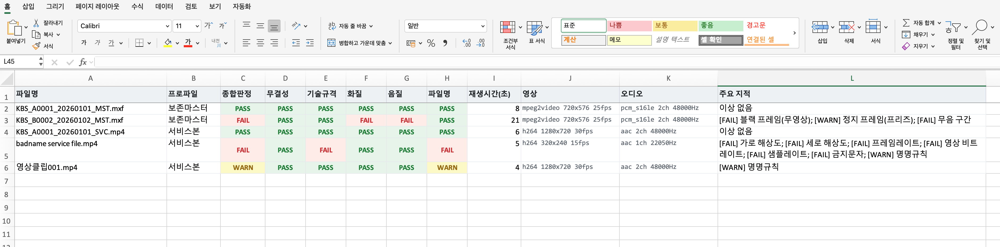

# 방송자료 디지털화 영상 검사 프로그램

방송자료 디지털화 사업에서 사업수행사가 납품한 변환 영상을 자동으로 검사하는 프로그램입니다. 제안요청서 감리 점검항목 가운데 **디지털 변환 부문**과 **자료 검증·납품 부문**의 파일 단위 항목(파일 규격, 영상·음성 품질, 파일명과 목록 정합성)을 표본으로 뽑아 실측하고, 판정과 근거를 정리합니다.

검사 엔진은 FFmpeg입니다. FFmpeg를 내장한 단일 실행파일로 배포하므로 검수 장소 PC에 따로 설치할 것이 없고, 실행 중 외부와 통신하지 않습니다.


## 검사 항목 (제안요청서 점검항목 대응)

제안요청서 상세 점검항목 가운데 파일에서 직접 측정할 수 있는 항목을 프로그램이 검사합니다. 장비·공정·메타데이터 내용·현장 보안처럼 판단이 필요한 항목은 감리원이 봅니다.

**디지털 변환 부문**

| 구분      | 제안요청서 기본점검항목                                    | 검사         |
| --------- | ---------------------------------------------------------- | ------------ |
| 파일 규격 | 포맷·코덱·해상도·비트레이트·재생시간·파일명                | **프로그램** |
| 품질관리  | 끊김·싱크 불일치·음성 누락·화면 깨짐·파일 손상             | **프로그램** |
| 매핑관리  | 원본ID·파일명·저장위치·변환상태·검수상태                   | **프로그램**·병행 |

**자료 검증 및 납품 부문**

| 구분            | 제안요청서 기본점검항목                  | 검사         |
| --------------- | ---------------------------------------- | ------------ |
| 수량 검증       | 원본·변환 수량, 누락·중복 여부           | **프로그램** |
| 파일 검증       | 파일명·폴더구조·포맷·용량·재생 가능 여부 | **프로그램** |
| 메타데이터 검증 | 필수항목·오탈자·매핑 오류                | **프로그램**·병행 |
| 납품 검증       | 저장구조·납품목록·저장매체 이상          | 병행         |
| 사후 조치       | 오류조치 내역·재납품·수정결과 확인       | 감리원       |

병행 항목은 프로그램이 파일명·수량·재생시간 같은 측정값을 대고, 실물 동일성과 최종 판단은 감리원이 맡습니다. 매핑관리는 파일명에 내장된 자료ID를 납품목록 자료ID와 대조하고(저장위치·검수상태는 감리원), 메타데이터 검증은 필수항목 누락·날짜 형식·그리고 목록에 적힌 해상도·코덱·컨테이너·재생시간을 실측(ffprobe)과 맞춰 봅니다(내용 판단은 감리원).


## 검사 방법

검사는 여섯 단계로 이어집니다. 납품 폴더를 훑어 영상 목록을 만들고, 통계 기준으로 표본을 뽑고, 파일마다 아래 항목을 순서대로 돌린 뒤, 항목별로 판정하고 증적을 남기고, 리포트를 만들고, 끝으로 감리원이 표본을 확인해 판정을 확정합니다.

| 검사 영역 | 세부 검사                                                | 사용 기법        | 잡아내는 결함                        |
| --------- | -------------------------------------------------------- | ---------------- | ------------------------------------ |
| 무결성    | 전체 스트림 디코드                                       | 디코드 오류 집계 | 파일 손상, 불완전 변환, 재생 불가    |
| 기술규격  | 컨테이너·코덱·해상도·프레임레이트·스캔·비트레이트·오디오 | 메타데이터 대조  | 규격 위반, 과압축, 인터레이스 미제거 |
| 화질      | 블랙 프레임                                              | blackdetect      | 무영상 구간(신호 유실)               |
| 화질      | 정지 프레임                                              | freezedetect     | 캡처 멈춤, 프레임 드롭               |
| 화질      | 레터·필러박스                                            | cropdetect       | 종횡비 변환 오류                     |
| 화질      | 휘도·채도 이상                                           | signalstats      | 신호 레벨 이탈, 색 소실              |
| 음질      | 무음 구간                                                | silencedetect    | 오디오 유실, 싱크 이상               |
| 음질      | 라우드니스·트루피크                                      | ebur128, astats  | 방송 레벨 부적정, 클리핑             |
| 동기화    | 영상·음성 싱크                                           | 스트림 시작 오프셋 | 립싱크 어긋남(A/V 정렬 오류)         |
| 파일명    | 명명규칙·금지문자·확장자·경로 길이                       | 규칙 대조        | 자동 처리 오류, 매체 이관 실패       |
| 매핑      | 파일명 내장 자료ID ↔ 납품목록 자료ID                     | 목록 대조        | 원본-변환 매핑 오류(잘못된 연결)     |
| 메타데이터 | 필수항목·날짜 형식·시스템 메타(해상도·코덱·컨테이너·시간) | 목록 vs 실측 대조 | 표준항목 누락, 입력 오탈자, 메타 불일치 |

제안요청서 품질관리 항목의 결함 유형은 아래 검사로 잡습니다. 끊김·프레임 드롭은 정지 검사로, 음성 누락은 무음 검사로, 화면 깨짐과 무영상은 블랙·신호 검사로, 파일 손상은 무결성 검사로, 싱크 불일치는 영상·음성 스트림의 시작 오프셋 차이로 직접 확인합니다(무음 구간·재생시간 대조로 보완).

각 검사가 실제로 재는 값은 이렇습니다. 무결성은 파일을 처음부터 끝까지 디코드하며 오류가 나는 지점을 셉니다. 기술규격은 파일에서 읽어 낸 코덱·해상도·프레임레이트·스캔 방식·비트레이트를 납품 규격의 허용 목록이나 허용 범위와 맞춰 봅니다. 블랙 검사는 화면에서 검은 픽셀이 차지하는 비율과 지속 시간으로 무영상 구간을 찾되, 시작과 끝의 정상 여백은 빼고 본편의 누적 비율로 판정합니다. 정지 검사는 프레임 사이 변화가 일정 수준 아래로 일정 시간 이상 이어지는 구간을 찾습니다. 휘도·채도는 1초에 한 프레임씩 뽑아 밝기와 채도의 평균을 내 신호 레벨이 벗어났는지 봅니다. 무음은 정해 둔 데시벨 아래가 일정 시간 이상 이어지는 구간을 찾아 본편 누적 비율로 판정하고, 라우드니스는 통합 라우드니스(LUFS)와 트루피크를 재 방송 레벨 기준과 견줍니다. 이때 쓰는 임계값(검은 픽셀 비율, 무음 데시벨, 라우드니스 목표 등)은 설정 파일에 있어 발주 규격에 맞춰 조정합니다.

항목마다 다섯 등급으로 판정합니다. 기준을 넘기면 통과(PASS), 경계선이면 주의(WARN), 기준에 못 미치면 미달(FAIL), 파일이 열리지 않으면 검사 불가(ERROR), 해당 없으면 생략(SKIP)입니다. 주의는 개선을 권고하고, 미달은 시정조치 대상이 되며, 검사 불가는 재생 불가로 보고 재변환을 요구합니다.

결함은 발생 지점과 수치를 함께 기록합니다. 검사 결과는 다음과 같은 형태로 나옵니다.

```
[FAIL] KBS_B0002_20260102_MST.mxf
       블랙(무영상) 08:00.0–13:00.0  누적 5.0초(23.8%)  → 신호 유실 의심, 재변환 검토
       무음 구간            누적 5.0초(23.8%)  → 오디오 유실·싱크 이상 의심
[FAIL] 납품목록 정합성   누락 1건 · 미등재 2건 · 재생시간 불일치 1건
```


## 표본 선정 기준

제안요청서는 표본검수 방식과 선정 기준을 감리계획서에 밝히도록 요구합니다. 표본은 다음 기준으로 정합니다.

표본 크기는 Cochran 공식에 유한모집단 보정을 적용해 신뢰수준 95%, 허용오차 ±5%로 계산합니다. 여기에 정보시스템 감리기준의 DB 검수 8% 이상 조건을 하한으로 둡니다. 최종 표본은 통계로 계산한 수와 8% 비율로 계산한 수 가운데 큰 쪽을 쓰고, 모집단이 30건 이하로 작으면 전수 검사합니다. 예를 들어 모집단이 1,200개면 통계 표본 292개와 8% 표본 96개 가운데 292개를 택합니다.

표본은 방송사와 매체·프로파일을 기준으로 층을 나눠 고르게 배분하고, 층마다 최소 표본 수를 보장해 특정 방송사나 매체의 결함이 통째로 빠지지 않게 합니다. 표본을 뽑는 방식은 고정 시드 기반이라, 같은 모집단과 기준이면 언제 돌려도 같은 표본이 나옵니다. 발주기관이 그대로 재현해 확인할 수 있습니다.

표본에서 미달 비율이 정해 둔 값을 넘으면 해당 층의 표본을 늘리거나 전수 검사로 바꾸고, 발주기관과 협의해 사업수행사에 전량 재검수나 재변환을 요구합니다.


## 설치와 실행

프로그램은 실행 파일(`vqc.exe`) 하나로 되어 있어 설치 과정이 없습니다. 아래에서 파일을 내려받아 원하는 폴더에 두고 바로 실행합니다. 별도 프로그램이나 FFmpeg를 깔 필요가 없습니다.

**내려받기**: [Releases 페이지](https://github.com/mhb8436/ff-aduit/releases/latest)에서 최신 `vqc.exe`를 받습니다.

Windows에서 검사하는 순서는 이렇습니다.

1. 받은 `vqc.exe`를 원하는 폴더에 둡니다. 예를 들어 `C:\vqc`에 둡니다.
2. 검사할 영상을 한 폴더에 모읍니다. 예를 들어 `D:\납품`에 둡니다. 방송사별·매체별로 하위 폴더가 나뉘어 있어도 괜찮습니다.
3. 시작 메뉴에서 `cmd`를 입력해 명령 프롬프트를 엽니다.
4. `vqc.exe`를 둔 폴더로 이동합니다. 예: `cd /d C:\vqc`
5. 다음 명령을 입력합니다.
   ```
   vqc.exe inspect D:\납품 --deep --report D:\결과
   ```
6. 검사가 끝나면 `D:\결과` 폴더의 `vqc_report.xlsx`를 엑셀로 엽니다.

대상으로는 영상이 든 최상위 폴더 하나만 지정하면 됩니다. 그 아래 하위 폴더까지 모두 뒤져 영상 파일을 찾으므로, 파일을 하나하나 나열할 필요가 없습니다. 폴더 대신 파일 하나를 지정하면 그 파일만 검사합니다. `vqc.exe`는 영상 폴더와 다른 곳에 두어도 되고, 결과를 저장할 폴더도 아무 데나 지정할 수 있습니다. 명령에서 대상 폴더 경로와 결과 폴더 경로만 정확히 적으면 됩니다.

납품목록 파일이 있으면 `--inventory`로 함께 지정해 목록과 실물을 대조합니다. 메타데이터 파일(제목·방송사명·방송일자·해상도·코덱 등이 든 CSV)이 따로 있으면 `--metadata`로 지정해 실측과 대조합니다.

```
vqc.exe inspect D:\납품 --deep --inventory D:\납품목록.csv --metadata D:\메타데이터.csv --report D:\결과
```

자주 쓰는 옵션은 다음과 같습니다.

| 옵션                | 뜻                                      |
| ------------------- | --------------------------------------- |
| `--report <폴더>`   | 결과 리포트를 저장할 폴더               |
| `--inventory <csv>` | 납품목록과 대조(수량·중복·자료ID 매핑·재생시간) |
| `--metadata <csv>`  | 메타데이터 CSV와 대조(필수항목·날짜·시스템 메타 실측) |
| `--deep`            | 화질·음질·정밀 무결성까지 검사(시간이 더 걸림) |
| `--no-sample`       | 표본 없이 전량 검사                     |

명령 입력이 번거로우면 위 명령을 적은 `검사.bat` 파일을 만들어 두고 더블클릭해도 됩니다. 예를 들어 아래 내용을 메모장에 적어 `vqc.exe`와 같은 폴더에 `검사.bat`으로 저장하면, 더블클릭만으로 검사가 돌아갑니다.

```
@echo off
vqc.exe inspect D:\납품 --deep --inventory D:\납품목록.csv --report D:\결과
pause
```


## 결과 보기

리포트는 세 가지로 나옵니다. 엑셀 파일(`vqc_report.xlsx`)은 영상 파일을 한 행씩 놓고 무결성·기술규격·화질·음질·파일명의 판정을 색으로 구분해, 어느 파일의 어느 부분이 문제인지 한눈에 보게 합니다. 요약 외에 항목별 상세, 납품목록 대조, 표본 정보 시트를 함께 담습니다. 이와 별도로 브라우저로 열어 보는 HTML, 원자료로 보관하는 JSON을 함께 만듭니다.




## 직접 빌드하기 (선택)

대부분은 위 Releases에서 `vqc.exe`를 받으면 되고, 이 과정은 필요하지 않습니다. 프로그램을 직접 만들려면 Go가 설치된 PC가 필요합니다([go.dev/dl](https://go.dev/dl)).

Windows에서는 PowerShell로 만듭니다.

```
cd goapp
powershell -ExecutionPolicy Bypass -File scripts\fetch_win_ffmpeg.ps1
go build -o dist\vqc.exe .
```

맥·리눅스에서는 다음과 같이 만듭니다. 맥 한 대에서 Windows·맥·리눅스 실행 파일을 함께 만들 수 있습니다.

```
cd goapp
bash scripts/fetch_win_ffmpeg.sh
bash build_all.sh
```

자세한 내용은 [`goapp/README.md`](goapp/README.md)를 참고합니다.


## 부록: 검사 기준 예시

아래는 감리 기본안입니다. 사업수행사의 작업지침서와 납품 규격이 확정되면 그 기준으로 바꿔 적용합니다. 검사 기준은 설정 파일로 관리하므로 감리 과정에서 그대로 공개할 수 있습니다.

| 구분         | 보존용 마스터(예)         | 활용·서비스용(예)          |
| ------------ | ------------------------- | -------------------------- |
| 컨테이너     | MXF·MOV·MKV               | MP4·MOV                    |
| 영상 코덱    | FFV1·MPEG-2·ProRes 등     | H.264                      |
| 해상도       | SD 720×576 ~ HD 1920×1080 | 480×360 ~ 1920×1080        |
| 프레임레이트 | 25·29.97·30·50·59.94      | 좌동                       |
| 스캔         | 인터레이스·프로그레시브   | 프로그레시브(디인터레이스) |
| 오디오       | PCM 48kHz 이상            | AAC 44.1kHz 이상           |
| 라우드니스   | EBU R128 −23 LUFS ±6      | 좌동                       |
